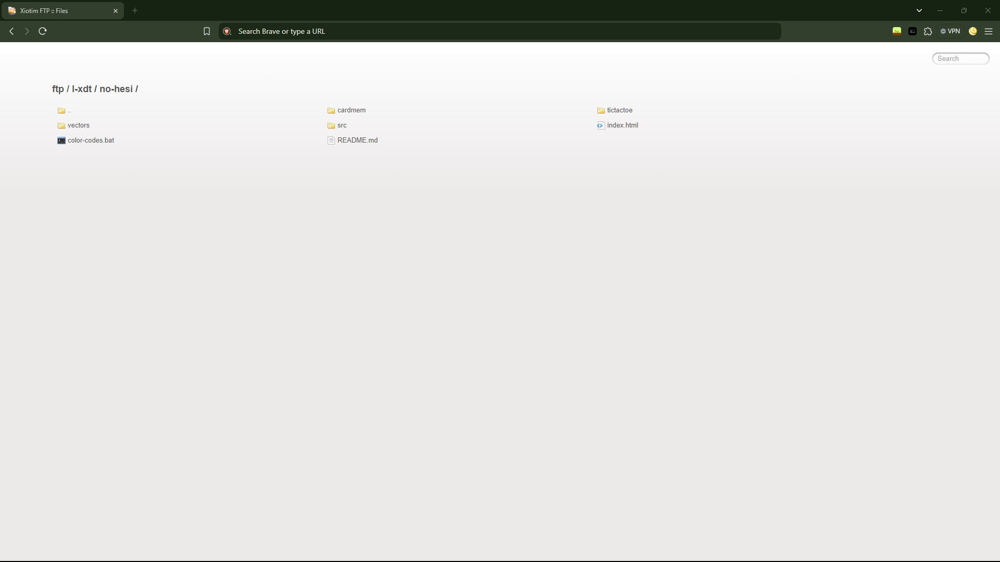

# FTP (x-FTP)

This is the FTP website, where it shows everything that has been posted to the GitHub (except this project, due to paradox.) This is the last repository on this account, we will go by LDT soon.

The assets can be found: [here](https://marketplace.visualstudio.com/items?itemName=ritwickdey.LiveServer).

**(Thanks Ritwick, for the FTP HTML!)**


## Acknowledgements

 - Made by: [Alvin Maranx, II ツ (Avun)](https://github.com/avunii/)

 - A huge shout-out to my 2nd last (supported project) at the time: [Documentation (x-Doc)](https://github.com/l-xdt/documentation/)
 - A huge help in this project: [DiffChecker](https://www.diffchecker.com)


## Authors

- [LeidenSchaft-Xiotim Development Team](https://www.github.com/l-xdt/)

- [Alvin Maranx, II ツ (Avun)](https://www.github.com/avunii/)

- [Ritwick Dey](https://github.com/ritwickdey/)

## Demo

This is not the Demo, just how you acess it: [here](https://l-xdt.github.io/ftp/).

## Features

- Working Search

- Covers every file on our GitHub page.

- Fullscreen mode.

- Cross platform (browsers).

- **PS:** These are the only implemented features, please don't add any, or just for it.


## Screenshots





**Written in Vanilla/Plain HTML, CSS and JavaScript**

## Run Locally

Clone the project, Modify it and Run it on XAMPP.

```bash
  git clone https://github.com/l-xdt/ftp/
```

Go to the project directory

```bash
  cd ftp
```

Install XAMPP (via Chocalatey, if you don't have it).

```bash
  chocalatey install xampp
```

Start the server

```bash
    [Directory]/[ServerName]/apache-start.bat
```

**PS:** (this is very much optional for this project.) If you trust your web skills, here is a manual on how to self-host a domain [here](https://www.youtube.com/watch?v=_eQGAJVtRCs) (by Soeng Souy)


## Roadmap

- Additional browser support.

- Change the HTML.

- Personalise the code.

- Change the search code.

- Add something new.

- Change the FavIcon (of-course) inspired by our Signature: **X**

- **Written in Vanilla HTML, CSS and JavaScript.**


## Support

For support, emails: [this one](mailto:trowesigames@gmail.com) or [this one](mailto:leidenschaft.tech@hotmail.com) or join our Discord Server: which is not up as of writing this.


## Feedback

This still applies to feedback aswell, Whether you want to give us positive words, or negative words, send away (but please only send constructive critisism).

Send away: [here](mailto:trowesigames@gmail.com) or [here](mailto:leidenschaft.tech@hotmail.com).


## FAQ

**Now for the last official time, my favourite, FAQ!**

#### Can I modify this to fit my needs?

Yeah, sure! That is why we make repositories like these public, for you tinker and try new things while learning.

#### Can I host this? If I can how?

You can! With my favourite Apache Container, XAMPP. since this is the last (official) repository here is a quick summary: 

So, Apache uses 127.0.0.1 which leads back every Windows and Linux, (and some configured macOS) machines, back to itself to host websites, and XAMPP gives it a GUI (Graphical Interface)

Here is a [download](https://www.apachefriends.org/download.html) to it. And if you are struggling with it here is a [tutorial](https://www.youtube.com/watch?v=LzucEZh4_no) (by MainlyWebStuff); and for the novices here is a tutorial on how to self-host a domain: [here](https://www.youtube.com/watch?v=_eQGAJVtRCs) (by Soeng Souy).

## Used By

This project is used by the following companies:

- LeidenSchaft-Xiotim Accquistions (Limited).

- XDT-Studium.

- Xiotim Development Team [Limited] (XDT).

- XDT-noHesi.


## Related

Here are some related projects (in order of release date):

- [FTP (x-FTP) - This project](https://github.com/l-xdt/ftp/)

- [L-XDT](https://github.com/l-xdt/l-xdt/)

- [Documentation (x-Doc)](https://github.com/l-xdt/documentation/)

- [Phone (xPhone-UI)](https://github.com/l-xdt/phone/)

- [xLinks](https://github.com/l-xdt/xlinks/)

- [XInterest](https://github.com/l-xdt/xinterest/)

- [Xelegram](https://github.com/l-xdt/xelegram/)

- [XApp](https://github.com/l-xdt/xapp/)

- [XCord](https://github.com/l-xdt/xcord/)

- [XChat](https://github.com/l-xdt/xchat/)

- [XGram](https://github.com/l-xdt/xgram/)

- [xSocial](https://github.com/l-xdt/xSocial/)

- [Xirox](https://github.com/l-xdt/xirox/)

- [XioTube](https://github.com/l-xdt/xiotube/)

- [Studium](https://github.com/l-xdt/studium/)

- [XioTok](https://github.com/l-xdt/xiotok/)

- [XioTim](https://github.com/l-xdt/xiotim/)

- [no-Hesi](https://github.com/l-xdt/no-hesi/)


## Documentation

- This project doesn't really have any good documentation, just a normal understanding of HTML and CSS to understand, (knowing JavaScript is optional, but would be a upperhand).

- But here is the link to the extension, I took the template from [Live Server](https://marketplace.visualstudio.com/items?itemName=ritwickdey.LiveServer) by Ritwick Dey (on Visual Studio Code Marketplace).


## API Reference

There are no APIs known of, this project only consists of Vanilla HTML, CSS, Javascript, and images. No frameworks, if there is, I will update this readMe.

